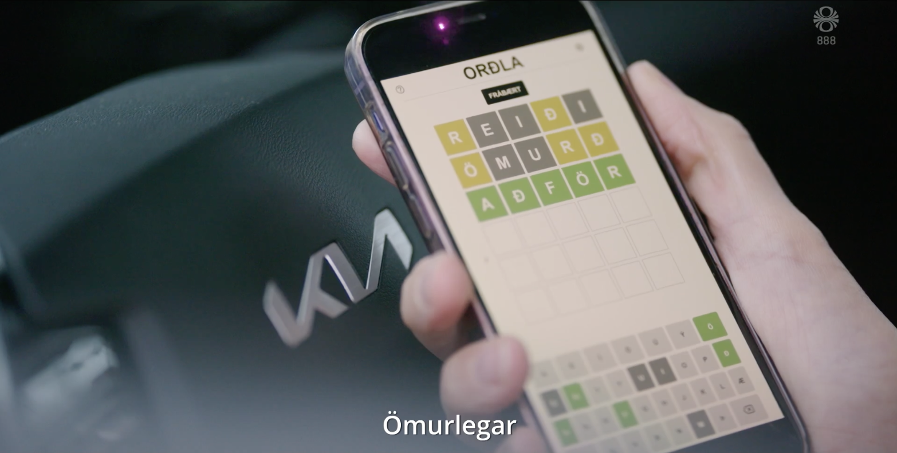

Title: Orðla means Wordle
Slug: ordla-means-wordle
Date: 2023-01-02 21:21:21
Lang: en
Tags: wordle, game

In January 2022 when the [Wordle][wordle] was the talk of the internet, I adapted the game to Icelandic. A few other attempts were made to do this but mine, found [at ordla.us][ordla], was the most successful clone - enough so to be featured in the [Áramótaskaup][skaup], a highly popular yearly comedy special which recaps the highlight of the passing year's events.

It's now been quite a while since its release but I am still playing it, and have even managed to be lucky enough to guess the word first try. I think that a few of the challenges with adapting it were interesting enough to merit a retro&shy;spective.

## Orðla

Accoring to [a news article at RÚV][topsearch] (Iceland's national public-service broadcasting organization) "orðla" was the second most popular search term submitted to Google.

The name _Orðla_ is a nonsense word, like _Wordle_. It was already going around as the name for the game, and I used it in a blatant attempt to usurp the place as the “official” clone.

A quick witted coworker suggested that I should register a .us domain name for it as _orðlaus_ does mean something in Icelandic: Wordless.

## The alphabet

The English alphabet has 26 letters, whereas the Icelandic one has 32 letters. This makes it harder to guess words for the same reason we're always being told to add special letters to our passwords.

I had been playing the game in English and anticipated that switching to my mother tongue would make it easier. But no, what I found was that it became harder. I solved this aspect of it by adding a a _handicap_ button: Click it at the start of the game and it will exclude 6 unused letters. This lowers the difficulty to match the original.

## The keyboard

The on-screen keyboard was a pain. It needs more letters on screen than is comfortable and players had very different opinions on what was a good layout. The game has 2 settings: ABCD or QWERTY order, and 3 or 4 rows. I say QWERTY, but Icelandic does not include Q or W, despite Icelandic keyboards having them. So the design players are used to typing on does not work well in the game.

Icelandic keyboard layout also does not feature accented letters, just a single accent character. But the accented letters need to feature on screen. Players may also type the letters on a keyboard if they are playing on desktop, and that must account for accented character composition. This is the sort of thing that is easy to omit (all other clones did) but is the sort of detail that can enormously frustrate users.

## The dictionary

Because of its inflection and compound system, the Icelandic language also has _way more_ words than English. The [Icelandic inflection system][grammar] is complex. A word exists in many forms and a big proportion of those forms may exist mostly because of the system, while not ever seeing much use. So an Icelandic player is likely to struggle guessing an unusual word-form.

The game uses two dictionaries, a dictionary of valid guesses, and a dictionary of solutions which is a subset of the former. For English, you would download a scrabble dictionary and filter it down to 5 letter words. But this is not the sort of thing that exists for Icelandic, so I had to create these.

Wordle has a simple randomized list of solution which it goes through linearly to pick the word of the day. To keep the application compact I had to compress my dictionaries, which means an alternative approach to picking word of the day is needed. To find the word of the day, Ordla [generates whole bunch of random words][wod_algo] until it finds one from the valid solutions list.

After filtering down to a subset of words that only included words in their root (or most basic) forms I ended up with about 23,000 words. Which is 10 times the size of Wordle's original dictionary. I then "simply" had go through all of them to hand pick a acceptable subset for solution, removing proper nouns, obscenities and obscure forms, as well as all words that feature a letter twice. I had noticed the double letters to be a source of Wordle players feeling the game wasn't fair.

The end result is a solution dictionary of about 2,300 words, same as the original game.

Amusingly I had made a mistake in the dictionary generation logic that caused obscenities to be excluded from the valid guesses. This [was pointed out to me](brund) within half an hour from release.

## The code is free

As with most projects like this that I do, the [code is open source][github]. Do with it what you will. But most importantly have fun!

[ordla]: https://ordla.us
[github]: https://github.com/borgar/ordla
[skaup]: https://en.wikipedia.org/wiki/%C3%81ram%C3%B3taskaupi%C3%B0
[grammar]: https://en.wikipedia.org/wiki/Icelandic_grammar
[bin]: https://bin.arnastofnun.is/leit/sanns%C3%B6gull
[wordle]: https://en.wikipedia.org/wiki/Wordle
[topsearch]: https://www.ruv.is/frettir/innlent/2023-01-04-landsmenn-leitudu-ad-arnari-grant-verbudinni-heimsmeistaramotinu-og-ordlu
[wod_algo]: https://github.com/borgar/ordla/blob/02362f248f851536e1431bcd64002798cbd70b38/src/dictionary.js#L80
[brund]: https://twitter.com/jobberwhack/status/1484848157888557057
